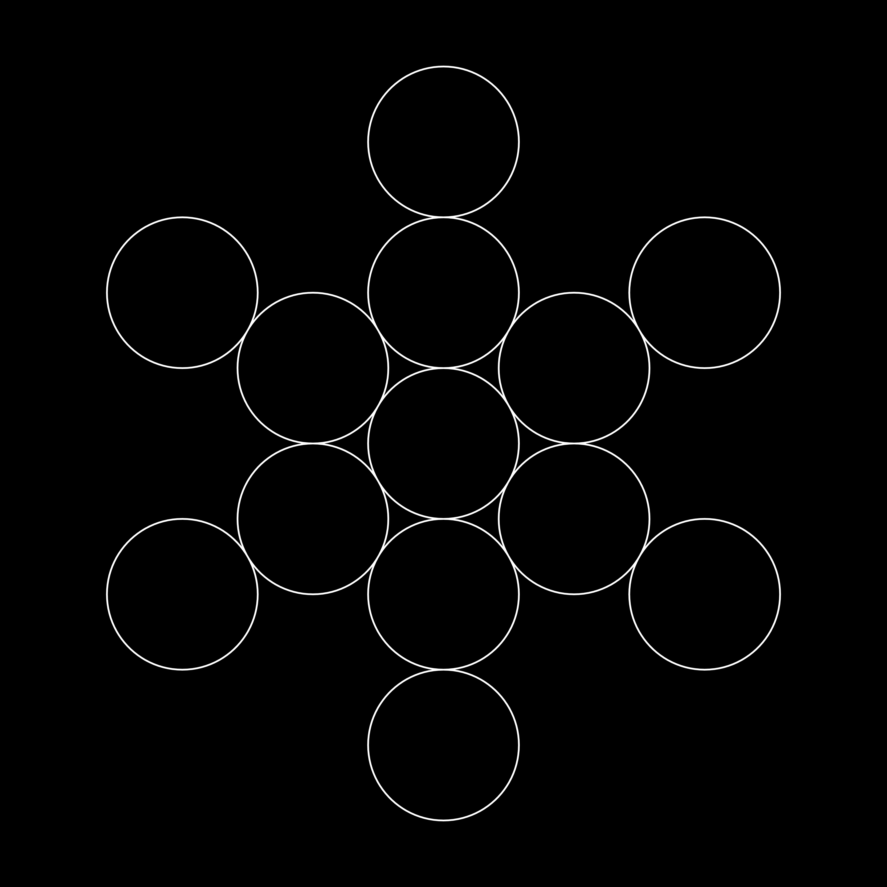

# The Fruit of Life

The **Fruit of Life** is a sacred geometric pattern considered one of the most important symbols in sacred geometry. It is derived from the **Flower of Life**, a foundational geometric figure. Learn more about the Flower of Life on its [Wikipedia page](https://en.wikipedia.org/wiki/Flower_of_Life).

## Structure and Geometry

- The Fruit of Life consists of **13 interconnected circles** derived from the Flower of Life pattern.
- Unlike the Flower of Life, it does not include overlapping arcs, emphasizing the circles themselves.
- It is often viewed as the **blueprint for Metatron's Cube**, which can be created by connecting the centers of the circles with straight lines.

## Symbolism

### 1. Blueprint of the Universe

- The Fruit of Life is considered the geometric foundation for all matter and energy.
- It is thought to represent the **building blocks of existence**.

### 2. Sacred Geometry

- It is closely linked to other sacred symbols, such as:
  - **Metatron's Cube**.
  - The **Platonic Solids**, which are three-dimensional shapes believed to embody the elements of creation.
- Serves as a bridge between **two-dimensional** and **three-dimensional** geometry.

### 3. Creation and Interconnection

- Symbolizes the interconnected nature of all things in the universe.
- Reflects the balance and harmony inherent in creation.

## Esoteric and Spiritual Interpretations

- **Map of Creation**: Seen as a representation of the divine plan or the map of the cosmos.
- **Spiritual Activation**: Used in meditation and energy work to activate higher states of consciousness.
- **Harmonic Resonance**: Thought to resonate with the frequencies of universal energy.

## Practical Uses

### 1. Meditation and Energy Work

- Used as a visual tool for meditation to align with universal energies and explore spiritual dimensions.

### 2. Art and Design

- Incorporated into art, jewelry, and architectural designs to convey harmony and balance.

### 3. Studies in Geometry

- Inspires exploration into three-dimensional forms and their connections to physical and metaphysical principles.

---

Would you like to explore more about **Metatron's Cube**, **Platonic Solids**, or how these symbols are used in spiritual practices and science?
